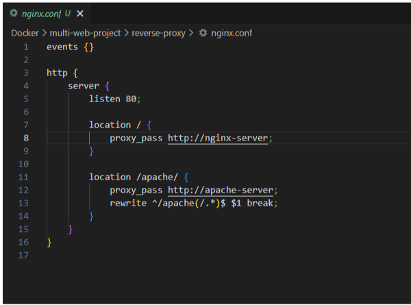

REVERSE PROXY 

En este desafío trabajaré con un docker compose multi stage,  el cual orquesta 3 contenedores.
2 web server y un nginx reverse proxy que será el encargado de redireccionar el tráfico.

Link del repositorio: 
https://github.com/romancete85/eduit.git
Docker/proxy-web-project

link del desafío: 
https://drive.google.com/drive/folders/1vsARH9e4C2kZy0FO0heXaFtH4xNrkEES?usp=sharing

Diagrama de arquitectura:

Dockerfile 
Creación de la estructura del proyecto “Multi-web-server”:

mkdir multi-web-project
cd multi-web-project

Creación de directorios para cada servicio:

Creación NGINX Server
dentro del directorio nginx-server:
cd nginx-server
creación de contenido donde se almacenarán los estáticos  index.html:
Creación del  Dockerfile para el NGINX server:

FROM nginx:alpine
COPY index.html /usr/share/nginx/html/index.html

Creación de Apache Server
Dentro del directorio  apache-server:
cd ../apache-server
creación de contenido donde se almacenarán los estáticos sample.html
Creación del  Dockerfile para el Apache server

FROM httpd:alpine
COPY sample.html /usr/local/apache2/htdocs/sample.html

Creación de  NGINX Reverse Proxy
Dentro del directorio reverse-proxy:
Creación del  Dockerfile para

FROM nginx:alpine
COPY nginx.conf /etc/nginx/nginx.conf

Creación del nginx.conf

Explicación:

Este archivo configura el servidor Nginx para actuar como un proxy inverso, redirigiendo las solicitudes a diferentes servidores backend.

Estructura Básica
El archivo nginx.conf está dividido en bloques que definen el comportamiento de Nginx para manejar eventos y peticiones HTTP.

events {}: Este bloque está presente pero vacío. Generalmente se usa para configurar parámetros relacionados con la gestión de conexiones, pero en este caso, no se especifican configuraciones adicionales

Bloque HTTP
El bloque http define la configuración relacionada con el manejo de peticiones HTTP.

Bloque Server
Dentro del bloque http, se define un bloque server que contiene la configuración específica del servidor HTTP.

listen 80: Este servidor escucha en el puerto 80, que es el puerto estándar para HTTP.
Bloques Location
Dentro del bloque server, se definen dos bloques location que determinan cómo manejar las solicitudes a diferentes rutas.
Location /
location /: Este bloque maneja todas las solicitudes a la raíz (/) del servidor.
proxy_pass http://nginx-server: Todas las solicitudes a la raíz se redirigen al servidor backend nginx-server. Esto significa que cualquier solicitud que llegue al proxy inverso en la ruta raíz será enviada al servicio nginx-server definido en tu archivo docker-compose.yml.
Location /apache/
location /apache/: Este bloque maneja todas las solicitudes que comienzan con /apache/.
proxy_pass http://apache-server: Las solicitudes a esta ruta se redirigen al servidor backend apache-server.
rewrite ^/apache(/.*)$ $1 break: Esta directiva reescribe la URL. La expresión regular ^/apache(/.*)$ captura todo lo que sigue a /apache y lo agrupa en $1. El $1 representa la parte capturada, y break detiene el procesamiento de más reescrituras. En efecto, esta reescritura elimina el prefijo /apache de la URL antes de que la solicitud se envíe al servidor Apache.
Resumen
Este archivo nginx.conf configura Nginx para actuar como un proxy inverso con las siguientes características:
Escuchar en el puerto 80: El servidor Nginx escucha las solicitudes en el puerto 80.
Redirección de la raíz:
Las solicitudes a la ruta raíz (/) se redirigen al servidor backend nginx-server.
Redirección y reescritura de la ruta /apache/:
Las solicitudes que comienzan con /apache/ se redirigen al servidor backend apache-server.
La URL se reescribe eliminando el prefijo /apache antes de redirigir la solicitud, de modo que el servidor Apache reciba la ruta correcta.
Esta configuración permite que el proxy inverso gestione las solicitudes y las dirija a los servidores correspondientes (Nginx o Apache) según la ruta de la solicitud.

Build and Push de las imágenes Docker:

Realizamos el buildeo de cada imagen ejecutando el dockerfile y su tag de versión correspondiente

Build and push NGINX server:

docker build -t romanfandrich/nginx-server:1.0 .
docker push romanfandrich/nginx-server:1.0

Build and push Apache server:

docker build -t romanfandrich/apache-server:1.0 .
docker push romanfandrich/apache-server:1,0

Build and push Apache server:

docker build -t romanfandrich/reverse-proxy:1.0 .
docker push romanfandrich/reverse-proxy:1.0

IMAGENES en docker hub

Creación de Docker-Compose File

En la raíz del proyecto root:
Creamos  docker-compose.yml:

Explicación del mismo:

version: '3': Esta línea especifica la versión del formato de archivo docker-compose.yml que se está utilizando. La versión 3 es compatible con Docker Engine 1.13.0 y versiones posteriores.
Servicios
El archivo define tres servicios: nginx-server, apache-server y reverse-proxy.
nginx-server
build:./nginx-server: Construye la imagen de Docker utilizando el Dockerfile ubicado en el directorio./nginx-server.
container_name: nginx-server: Asigna el nombre nginx-server al contenedor.
volumen: Monta un volumen llamado nginx_data en el directorio /usr/share/nginx/html dentro del contenedor, que es donde Nginx sirve los archivos HTML.
networks: Conecta este contenedor a la red definida como my_network.
apache-server
build:./apache-server: Construye la imagen de Docker utilizando el Dockerfile ubicado en el directorio ./apache-server.
container_name: apache-server: Asigna el nombre apache-server al contenedor.
volumen: Monta un volumen llamado apache_data en el directorio /var/www/html dentro del contenedor, que es donde Apache sirve los archivos HTML.
networks: Conecta este contenedor a la red definida como my_network.
reverse-proxy
build:./reverse-proxy: Construye la imagen de Docker utilizando el Dockerfile ubicado en el directorio ./reverse-proxy.
Ports: Publica el puerto 80 del contenedor en el puerto 80 del host. Esto es para que el reverse proxy sea accesible externamente.
depends_on: Define una dependencia para asegurar que los contenedores nginx-server y apache-server se inicien antes que el reverse-proxy.
container_name: reverse-proxy: Asigna el nombre reverse-proxy al contenedor.
networks: Conecta este contenedor a la red definida como my_network.
Volúmenes
nginx_data: Define un volumen para persistir los datos servidos por Nginx.
apache_data: Define un volumen para persistir los datos servidos por Apache.
Redes
my_network: Define una red llamada my_network usando el controlador bridge. Esto permite que los contenedores se comuniquen entre sí.

Run del Docker Compose

Navegar nuevamente al root del  proyecto:
inicializar los servicios  del Docker Compose:

docker-compose up -d

Visualización Multicapa en Docker Desktop:

Persistencia de volúmenes:

Prueba de conexión redireccionamiento a index.htm ( NGINX-SERVER )

Prueba de conexión redireccionamiento a index.htm ( APACHE-SERVER )

Removido del proyecto:

Listamos con el comando: docker images

Eliminamos proyecto con: docker-compose down

También se puede hacer individualmente con los siguiente comandos:

docker ps 
docker stop
docker ps -a  ( se visualizan los contenedores parados )
docker rm 
docker image prune -a  ( elimina todos los recursos en desuso )

 -

Resumen
Create project structure and directories for NGINX server, Apache server, and reverse proxy.
Create index.html for NGINX server and sample.html for Apache server.
Create Dockerfile for each service to build Docker images.
Set up NGINX configuration in the reverse proxy to route traffic to the appropriate servers.
Create docker-compose.yml to define and manage the services.
Build and push Docker images to Docker Hub.
Run Docker Compose to start the services and set up the reverse proxy.

Links de interés y documentación consultada:

Docker compose LAMP: https://github.com/sprintcube/docker-compose-lamp/blob/master/dev_build_container.sh

LAMP con maria db : https://mariadb.com/kb/en/setting-up-a-lamp-stack-with-docker-compose/

Setear un docker compose nginx reverse proxy : https://www.youtube.com/watch?v=hxngRDmHTM0

Repositorio reverse proxy : https://github.com/productive-dev/minimal-reverse-proxy-demo

https://maxtsh.medium.com/a-practical-guide-to-implementing-reverse-proxy-using-dockerized-nginx-with-multiple-apps-ad80f6dfce17

