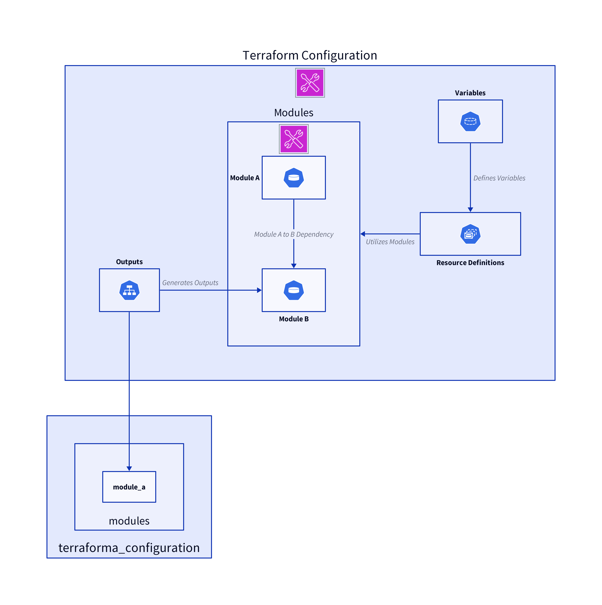
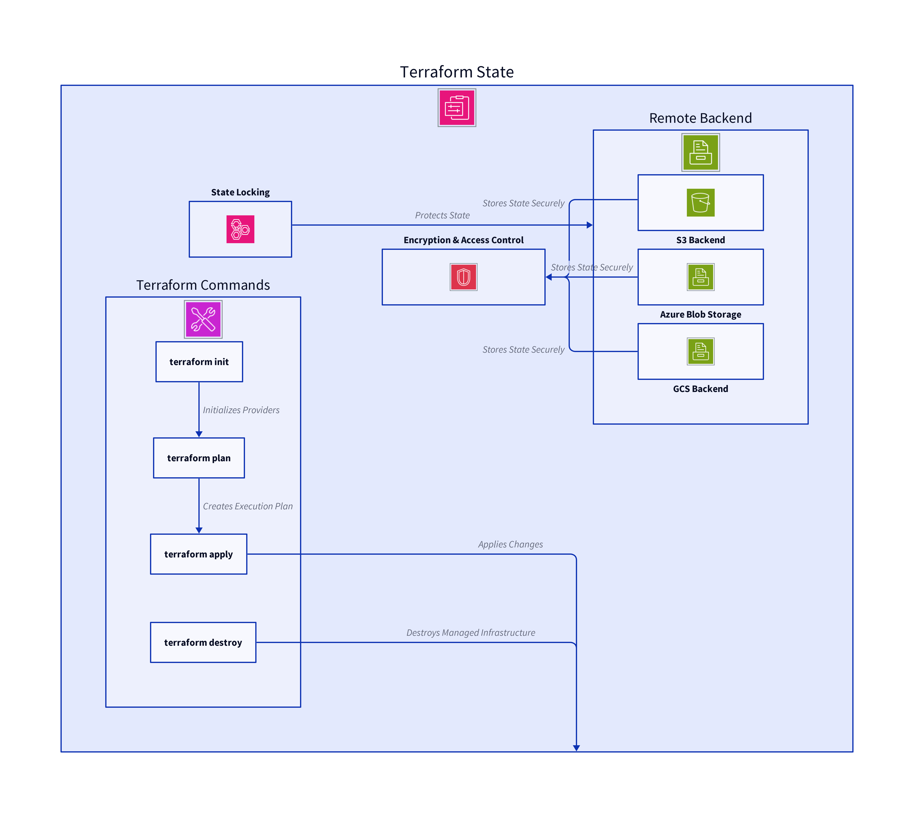
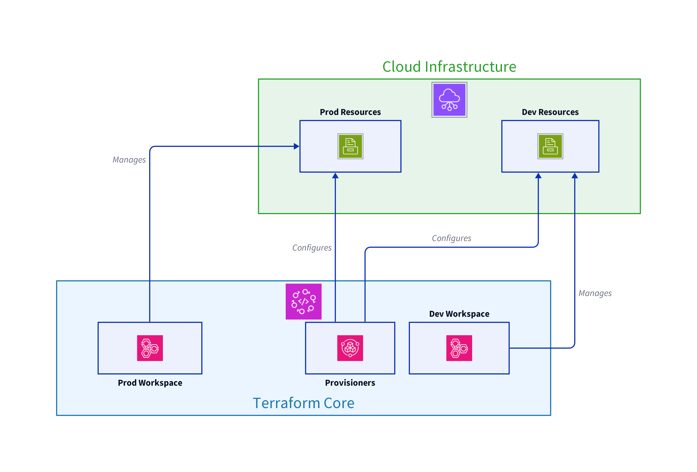
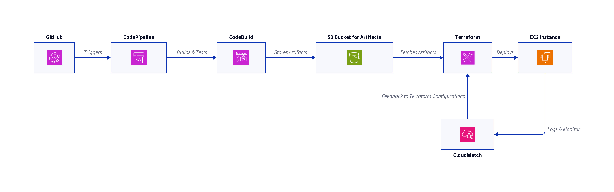
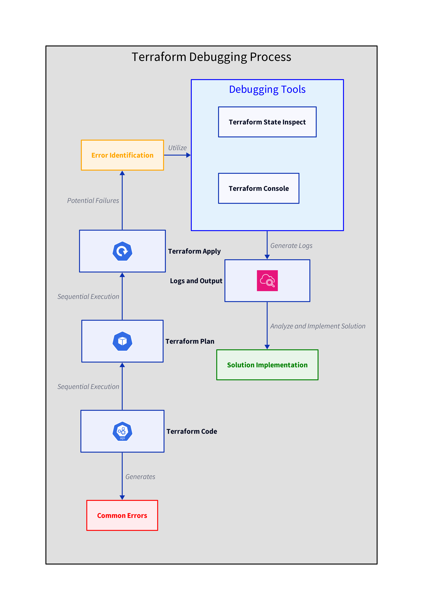

# Writing Terraform Configurations: A Comprehensive Guide
In this guide, we'll explore how to write effective Terraform configurations. Terraform, a tool created by HashiCorp, is used to define and provision infrastructure through code. Its configuration language, HashiCorp Configuration Language (HCL), allows for concise description of resources in a human-readable format. We'll cover the basics of HCL, resource definitions, variables, outputs, and how to use modules to create reusable components.

## Understanding HashiCorp Configuration Language (HCL)
HCL is the heart of Terraform. It's designed to be both human-readable and machine-friendly, providing a clear syntax for configuring infrastructure.

# Basic Syntax
HCL uses blocks, arguments, and expressions:

resource "aws_instance" "example" {
  ami           = "ami-123456"
  instance_type = "t2.micro"
}
Blocks define objects (like resources or providers).
Arguments assign values to the properties of blocks.
Expressions represent values, including referencing other resources.
Variables and Outputs
Variables allow customization without altering the main configuration, while outputs let you query specific data about your resources.

variable "instance_type" {
  description = "EC2 instance type"
  default     = "t2.micro"
}

output "instance_ip" {
  value = aws_instance.example.public_ip
}

## Defining Resources
Resources are the most crucial part of Terraform configurations, representing infrastructure components.

## Basic Resource Definition
# Here's how to define a simple AWS EC2 instance:

resource "aws_instance" "my_instance" {
  ami           = var.ami
  instance_type = var.instance_type
}
This block creates an EC2 instance with the specified AMI and instance type.

Resource Dependencies
Terraform automatically detects dependencies between resources to create them in the correct order. You can also define explicit dependencies using the depends_on argument.

resource "aws_eip" "lb" {
  instance = aws_instance.my_instance.id
  depends_on = [
    aws_instance.my_instance,
  ]
}
### Variables: Enhancing Configuration Flexibility
Variables abstract configurations, making them reusable and customizable.

## Declaring Variables
Declare a variable using the variable block, optionally with default values:

variable "region" {
  description = "Deployment region"
  default     = "us-west-2"
}
Using Variables
Use variables by referencing them with var.<NAME>:

provider "aws" {
  region = var.region
}
Passing Variables in Terraform and Their Precedence
Terraform allows you to pass variables in various ways, each with a specific precedence. Here's an overview of the different methods and their order of precedence from highest to lowest:

## CLI Arguments
Environment Variables
Terraform.tfvars File
Auto-Loaded *.auto.tfvars Files
Variable Defaults in Configuration
1. CLI Arguments
Variables can be passed directly via the command line using the -var flag.

### Example:

terraform apply -var="instance_type=t2.micro"
Precedence: Highest. Values passed this way override all other variable sources.

2. Environment Variables
You can set variables using environment variables. Terraform reads environment variables with the TF_VAR_ prefix.

Example:

export TF_VAR_instance_type=t2.micro
terraform apply
Precedence: Second highest. Overrides *.tfvars files and variable defaults but not CLI arguments.

3. terraform.tfvars File
You can create a terraform.tfvars file to define variables.

Example (terraform.tfvars):

instance_type = "t2.micro"
Precedence: Third highest. Overrides auto-loaded *.auto.tfvars files and variable defaults but is overridden by environment variables and CLI arguments.

4. Auto-Loaded *.auto.tfvars Files
Any file with the *.auto.tfvars extension in the root module directory will be automatically loaded.

Example (variables.auto.tfvars):

instance_type = "t2.micro"
Precedence: Fourth highest. Overrides variable defaults but is overridden by terraform.tfvars, environment variables, and CLI arguments.

5. Variable Defaults in Configuration
Variables can have default values specified within the Terraform configuration.

Example (variables.tf):
```sh
variable "instance_type" {
  description = "Type of instance to use"
  default     = "t2.micro"
}
```
Precedence: Lowest. Used only if no other value is provided by any of the higher-precedence methods.

Outputs: Extracting Information
Outputs allow you to extract information from your resources, which can be useful for interfacing with other tools or Terraform configurations.

Defining Outputs
Define an output for an AWS instance's public IP:
```sh
output "public_ip" {
  value = aws_
}
  ```

## Modules: Promoting Reusability
### Modules are containers for multiple resources that are used together. They promote reusability and manageability of Terraform configurations.

## Creating a Module
### Create a module by defining resources in a separate directory. For instance, a webserver module could include an EC2 instance and a security group.

webserver/main.tf:

```sh
resource "aws_instance" "web" {
  ami           = var.ami
  instance_type = var.instance_type
}

resource "aws_security_group" "web" {
  // Security group rules...
}
Using Modules
Use a module by referencing its source path and passing any required variables:

module "webserver_module" {
  source       = "./modules/webserver"
  ami          = "ami-123456"
  instance_type = "t2.micro"
}
```

## Best Practices for Terraform Configurations
Organize Resources Logically: Group related resources in the same file or module.
Use Variables and Outputs Judiciously: Define variables for elements likely to change and outputs for important information.
Format and Validate Your Code: Regularly use terraform fmt to format your code and terraform validate to check for errors.
Document Your Configurations: Comment your code and document variables and outputs for clarity.
By following these guidelines and understanding the fundamental concepts outlined in this guide, you'll be well on your way to writing effective Terraform configurations. Whether you're managing a small project or a large infrastructure, Terraform, coupled with best practices, can help you achieve your goals with efficiency and control.

### Architecture Diagram




###############################################################################################


# 🧮 Managing Terraform State: Best Practices and Security
Terraform, a widely used infrastructure as code tool, allows for the automation of infrastructure provisioning across multiple service providers. Central to Terraform's functionality is the concept of "state," a crucial component that tracks the state of your infrastructure and configuration. This document aims to educate beginners on the importance of Terraform state, how it's managed, and strategies for securely handling state files, including state locking, state file storage, and the use of remote backends.

## 🔬 Understanding Terraform State
Terraform state is a JSON file that Terraform generates automatically during the terraform apply command. This file contains vital information about the resources Terraform creates, allowing Terraform to map real-world resources to your configuration and keep track of metadata.

### Diagram


## Why is State Important?
Synchronization: It ensures that Terraform's actions are based on the most current information about your infrastructure, preventing conflicts.
Dependency Resolution: Terraform uses the state to determine the order in which resources should be created, updated, or deleted.
Inspection: Users can query the state to inspect Terraform-managed infrastructure without accessing the cloud provider's console or API.
## 🎋 Managing State Files
Terraform state can be managed locally or remotely, each with its own set of considerations for security and collaboration.

## Local State Management
By default, Terraform stores state locally in a file named terraform.tfstate. While this is simple and convenient for individual use, it poses challenges for team collaboration and security.
```sh
terraform {
  backend "local" {
    path = "relative/path/to/terraform.tfstate"
  }
}
```
## Remote State Management
For teams and projects requiring collaboration, remote state backends like AWS S3, Azure Blob Storage, or Google Cloud Storage are recommended. Remote backends offer several advantages:

## Shared Access: Team members can access the state concurrently, allowing for collaborative work on infrastructure.
Security: Remote backends can be secured with encryption, access controls, and other cloud-provider security features.
State Locking: Prevents concurrent state operations, reducing the risk of corruption.

Example: Configuring an S3 Backend
```sh
terraform {
  backend "s3" {
    bucket         = "my-terraform-state-bucket"
    key            = "path/to/my/terraform.tfstate"
    region         = "us-east-1"
    encrypt        = true
    dynamodb_table = "my-lock-table"
  }
}
```
### This configuration stores the state in an encrypted form in an S3 bucket and uses a DynamoDB table for state locking.

## 🔐 State Locking
State locking is crucial for preventing multiple users from making simultaneous changes to the state, which can lead to conflicts or corruption. Terraform automatically locks the state for all operations that could write state, such as terraform apply or terraform destroy.

### How State Locking Works
When Terraform needs to lock the state, it creates a lock in the configured backend. If another operation tries to modify the state while it's locked, Terraform will wait for the lock to be released or fail after a timeout.

## 🧰 Security Considerations for State Files
State files can contain sensitive information, such as passwords or access keys. Therefore, securing state files is paramount.

### Strategies for Securing State Files
Encryption: Always use backends that support encryption at rest.
Access Control: Limit access to the state files using IAM roles or similar mechanisms.
Regular Auditing: Periodically review access logs and permissions to ensure that only authorized users can access the state files.
🧾 Common Issues and Best Practices
### Common Issues
State Drift: This occurs when manual changes are made to the infrastructure outside of Terraform, causing the state to be out of sync.
Large State Files: These can slow down Terraform operations and increase the risk of timeouts or errors.
Best Practices
Regularly Review State Files: Use terraform plan to detect and address drift.
State File Optimization: Break down large configurations into smaller, manageable modules to keep state files lean.
Secure State Files: Apply encryption, access controls, and monitor access patterns.
## 🎉 Conclusion
Effective state management is critical for the successful use of Terraform at scale. By understanding and implementing the practices outlined in this document, users can ensure their infrastructure is managed securely and efficiently. Whether you're working solo or as part of a large team, these strategies will help you leverage Terraform's capabilities while minimizing risks associated with state management.


#############################################################################################################


# ⛳ Advanced Features of Terraform: Workspaces, Provisioners, and Data Sources
Terraform is a powerful tool for building, changing, and versioning infrastructure safely and efficiently. This guide delves into few of its more advanced features: workspaces, provisioners and data sources. Also, you will get briefly acquainted with HCP terraform, formerly Terraform Cloud.

Designed for beginners, this document explains how to manage multiple environments with workspaces, utilize provisioners for post-deployment tasks and use data sources to reference some attributes of non-terraform resources, incorporating clear examples and simple analogies to aid understanding.

Diagram


## 🔰 Terraform Workspaces
Imagine you're an artist with a single canvas, but you wish to paint different scenes without mixing them up. Terraform workspaces serve a similar purpose in managing distinct instances of your infrastructure with ease, akin to having multiple canvases.

## Understanding Workspaces
A Terraform workspace is a named container that holds a separate state for your infrastructure. By default, Terraform operates in a workspace named default. However, you can create multiple workspaces to manage different environments (e.g., development, staging, production) without the risk of interfering with each other.

Creating and Managing Workspaces
To start using workspaces, you first need to understand how to create and manage them. Here's a step-by-step guide:

Creating a New Workspace
terraform workspace new dev
This command creates a new workspace named dev. Terraform will automatically switch to this workspace upon creation.

Listing Workspaces
terraform workspace list
This will list all workspaces, with the current workspace highlighted.

Switching Workspaces
terraform workspace select dev
Switch to the dev workspace with this command.

### Using Workspaces in Configuration
To leverage the power of workspaces within your Terraform configurations, you can use the ${terraform.workspace} interpolation. This allows for dynamic changes based on the current workspace. For example:

```sh
resource "aws_s3_bucket" "example" {
  bucket = "my-app-${terraform.workspace}"
  acl    = "private"
}
```

In the dev workspace, this configuration will create an S3 bucket named my-app-dev.

## 🔩 Terraform Provisioners
After Terraform creates your resources, you might want to perform additional tasks like running a script or configuring a service. Provisioners in Terraform are your tools for these post-deployment activities.

Understanding Provisioners
Think of provisioners as the crew that comes in after a building is constructed to paint the walls and install the carpets. They're the final touch that makes the space usable.

### Types of Provisioners
Local-exec: Executes a command on the machine running Terraform.
Remote-exec: Executes a command on the newly created resource.
Using the Local-exec Provisioner
The local-exec provisioner can be used to run scripts on your local machine after a resource is created. For example, to send a notification:
```sh
resource "aws_instance" "example" {
  # ...

  provisioner "local-exec" {
    command = "echo 'New instance created' > instance_creation.txt"
  }
}
```
Using the Remote-exec Provisioner
The remote-exec provisioner allows you to run commands on a remote resource after it's been created. This requires connection details:
```sh
resource "aws_instance" "example" {
  # ...

  provisioner "remote-exec" {
    inline = [
      "sudo apt-get update",
      "sudo apt-get install -y nginx",
    ]

    connection {
      type        = "ssh"
      user        = "ubuntu"
      private_key = file("~/.ssh/id_rsa")
      host        = self.public_ip
    }
  }
}
```

## Best Practices for Using Provisioners
Idempotency: Ensure your scripts can run multiple times without causing errors or unintended consequences.
Minimal Use: Provisioners should be a last resort. Prefer using other Terraform resources or data sources if possible.
## 🌟 Data Sources
Data sources are used to retrieve information about existing resources or external systems that are not managed by Terraform. They allow you to query and reference this data within your Terraform configurations.

For example, if you need to use the latest Amazon Linux AMI for your EC2 instances but don't manage the AMI directly, you can use a data source to fetch this information. Here's a concise example:
```sh
data "aws_ami" "latest_amazon_linux" {
  owners      = ["amazon"]
  most_recent = true
  filters {
    name   = "name"
    values = ["amzn2-ami-hvm-*-x86_64-gp2"]
  }
}

resource "aws_instance" "example" {
  ami           = data.aws_ami.latest_amazon_linux.id
  instance_type = "t2.micro"
}
```
## ⛅ HCP Terraform
HashiCorp Cloud Platform (HCP) Terraform is a service provided by HashiCorp that simplifies the management of Terraform infrastructure by offering a managed Terraform Cloud environment. It allows you to securely and efficiently run Terraform workflows without needing to manage the infrastructure yourself.

### Key Features:
Managed Infrastructure: HCP Terraform handles the underlying infrastructure for running Terraform, including scaling and high availability.
Secure Storage: Provides secure storage for state files and sensitive data, reducing the risk of data loss or exposure.
Integrated Secrets Management: Integrates with HashiCorp Vault for managing secrets and sensitive data.
Collaboration: Facilitates team collaboration with features like version control, access management, and remote state management.

## 🎉 Conclusion
Terraform's workspaces and provisioners are powerful features that, when used correctly, can significantly enhance your infrastructure management and automation capabilities. Workspaces allow for seamless management of multiple environments, while provisioners offer the flexibility to perform necessary actions on your resources post-deployment. By understanding and applying these features, you can take your Terraform projects to the next level.

#############################################################################################################


# 🔨 Automating AWS Infrastructure Deployments with Terraform and CI/CD Integration
Deploying and managing infrastructure manually in the cloud can be time-consuming and prone to errors. Automation tools like Terraform, combined with Continuous Integration/Continuous Deployment (CI/CD) pipelines, can significantly streamline this process.

This guide will walk you through automating AWS infrastructure deployments using Terraform and integrating this process into a CI/CD pipeline with AWS CodePipeline.

## 🔰 Introduction to Terraform and CI/CD
Before diving into the specifics, let's briefly understand what Terraform and CI/CD are and how they contribute to infrastructure management and automation.

### 🏴 Terraform
Terraform is an open-source Infrastructure as Code (IaC) tool developed by HashiCorp. It allows you to define your infrastructure using a high-level configuration language. Terraform uses this configuration to create an execution plan that outlines what it will do to reach the desired state and then executes it to build the described infrastructure.

## 🏴 Continuous Integration/Continuous Deployment (CI/CD)
CI/CD is a method to frequently deliver apps to customers by introducing automation into the stages of app development. The main concepts attributed to CI/CD are continuous integration, continuous delivery, and continuous deployment. CI/CD pipelines are designed to mitigate the risks in software delivery process, automate steps, and improve productivity and quality.

## 🧾 Integrating Terraform with AWS CodePipeline
AWS CodePipeline is a fully managed continuous delivery service that helps automate release pipelines for fast and reliable application and infrastructure updates. Integrating Terraform with AWS CodePipeline allows you to automate the deployment and management of your AWS infrastructure.

Updated Diagram


## 🔧 Setting Up the Environment
To start, you need an AWS account, Terraform installed on your local machine, and the AWS CLI configured.

Below is an overview for these steps, however, you don't need to try it in the terminal as both Terraform and AWS are already present.

### Install Terraform
#### Download the Terraform binary
```sh
wget https://releases.hashicorp.com/terraform/0.14.9/terraform_0.14.9_linux_amd64.zip
```

## Extract the binary
```sh
unzip terraform_0.14.9_linux_amd64.zip
```

### Move the binary to your PATH
```sh
sudo mv terraform /usr/local/bin/
Configure AWS CLI

## Configure AWS Access
aws configure
Enter your AWS Access Key ID, Secret Access Key, and default region when prompted.

```

## ✍ Creating a Terraform Configuration
Create a new directory for your Terraform configuration and initialize a Terraform project.
```sh
mkdir terraform-aws-deployment
cd terraform-aws-deployment
terraform init
```
Create a file named main.tf and add your AWS resource configuration. For example, to create an S3 bucket:
```sh
provider "aws" {
  region = "us-east-1"
}

resource "aws_s3_bucket" "my_bucket" {
  bucket = "my-unique-bucket-name"
  acl    = "private"
}
```

## 📝 Setting Up AWS CodePipeline
Create a GitHub Repository: Store your Terraform configuration in a GitHub repository. This will be used as the source stage for your pipeline.

Create a BuildSpec File: AWS CodeBuild uses a build specification (buildspec.yml) to run build commands. Create a buildspec.yml in your repository root that defines the build commands and configurations used by CodeBuild.
```sh
version: 0.2

phases:
  install:
    commands:
      - wget https://releases.hashicorp.com/terraform/0.14.9/terraform_0.14.9_linux_amd64.zip
      - unzip terraform_0.14.9_linux_amd64.zip
      - mv terraform /usr/local/bin/
  pre_build:
    commands:
      - terraform init
  build:
    commands:
      - terraform apply -auto-approve
```

### Create a CodePipeline: Use the AWS Management Console to create a new pipeline. Select GitHub as the source provider and connect to your repository. For the build stage, select AWS CodeBuild and provide the buildspec.yml file. The deploy stage can be skipped since Terraform will handle the deployment.

## 🧮 Automating Deployments
Once the pipeline is set up, any commit to the repository will trigger the pipeline. The pipeline will execute the Terraform commands defined in buildspec.yml, applying your infrastructure changes automatically.

## 💯 Best Practices for Terraform and CI/CD Integration
Use Remote State: Store your Terraform state file in a remote backend like S3 to share state across your team and prevent conflicts.
Implement Workspaces: Use Terraform workspaces to manage separate environments (e.g., development, staging, production) within the same configuration.
Secure Secrets: Use tools like AWS Secrets Manager or HashiCorp Vault to manage secrets and sensitive information. Avoid hardcoding secrets in your Terraform configuration or buildspec.yml.
Review Pull Requests: Implement a code review process for changes to your Terraform configuration to ensure quality and compliance.
## 🎉 Conclusion
Congratulations! You've successfully integrated Terraform with AWS CodePipeline.

Integrating simplifies and automates the process of deploying and managing AWS infrastructure.

By following the steps and best practices outlined in this guide, you can achieve consistent and repeatable infrastructure changes, reduce manual errors, and improve the efficiency of your deployment processes.


#############################################################################################


# 📇 Troubleshooting and Debugging Terraform Configurations
In this guide, we will explore common issues encountered when working on AWS with Terraform, a popular infrastructure as code tool, and how to effectively troubleshoot and debug these problems. Whether you're a beginner or have some experience with Terraform, understanding how to diagnose and resolve issues is crucial for maintaining efficient and reliable infrastructure deployments.

## 🧐 Understanding Terraform Errors
Terraform errors can often appear daunting at first glance, but they generally fall into a few categories that can guide us towards resolution.

### Syntax Errors
Syntax errors occur when the code doesn't follow Terraform's expected format. These are often the easiest to fix but can be frustrating if not spotted early.

Example:
```sh
resource "aws_s3_bucket" "example" {
  name = "my-unique-bucket-name"
  acl = "private"
}
```
A missing equals sign = after acl would result in a syntax error.

Authentication Issues
Authentication issues arise when Terraform cannot properly authenticate with the cloud provider. This could be due to missing credentials or incorrect permission settings.

Example:
```sh
Error: No valid credential sources found for AWS Provider.
```
This error indicates that Terraform cannot find your AWS credentials.

### Resource Errors
Resource errors happen when there's an issue with the infrastructure you're trying to manage, such as trying to create a resource that already exists.

Example:
```sh
Error: A resource with the ID "my-unique-bucket-name" already exists.
```
This error suggests that the S3 bucket you're trying to create already exists.

## ⏳ Debugging Techniques
Debugging in Terraform involves a combination of reading error outputs, understanding the state of your infrastructure, and using Terraform's built-in tools.



### Reading Terraform Plan Output
Before applying changes, always run terraform plan. It provides a preview of the actions Terraform will take, which can help identify potential issues early.
```sh
terraform plan
```
Using TF_LOG
Terraform has a detailed logging mechanism that can be enabled by setting the TF_LOG environment variable. It can be set to DEBUG, INFO, WARN, ERROR, or TRACE.
```sh
export TF_LOG=DEBUG
terraform apply
```
This command will output a lot of debug information, which can be useful for pinpointing the source of an issue.

Terraform State Inspection
Terraform maintains the state of your managed infrastructure. Inspecting the state can help understand the current configuration and identify discrepancies.
```sh
terraform state list
```
This command lists all the resources in your current state.

Using terraform console
The terraform console command allows you to interact with the state and perform real-time evaluations of expressions, which can be useful for debugging.
```sh
terraform console
> aws_s3_bucket.example.arn
```
This command would output the ARN of the specified S3 bucket if it exists.

## 🤓 Common Solutions
Syntax Errors
For syntax errors, always refer to the Terraform documentation for the correct format. Tools like terraform validate can help catch these errors early.
```sh
terraform validate
```
Authentication Issues
Ensure your cloud provider credentials are correctly configured. For AWS, for example, this might involve setting up the AWS CLI or configuring environment variables.
```sh
aws configure
```
Resource Errors
For resource conflicts, ensure that the resources you're trying to create do not already exist, or use terraform import to bring an existing resource into Terraform management.
```sh
terraform import aws_s3_bucket.example my-existing-bucket
```
## 🎉 Conclusion
Debugging Terraform configurations requires patience and a systematic approach. By understanding common error types, utilizing Terraform's debugging tools, and applying general troubleshooting strategies, you can resolve most issues encountered during Terraform development. Remember, the Terraform community and documentation are valuable resources when you're stuck.
